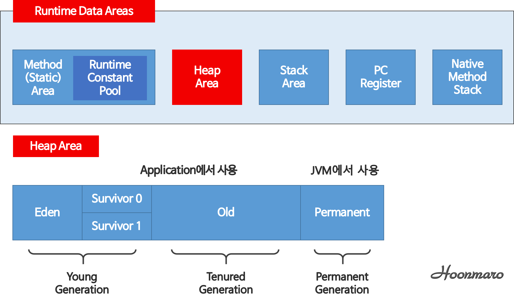

# JVM

## 1. JVM (JAVA Virtual Machine) 이란?

- 자바 가상머신 (프로그램을 실행하기 위해 물리적으로 유사한 머신을 소프트웨어로 구현한 것)
- Java 와 OS 사이에서 중재자 역할을 하며 Java 가 OS에 구해받지 않고 재사용 가능하도록 한다.
- 메모리 관리 (Garbage Collection)수행 한다.
- 스택기반의 가상머신
- 클래스로더를 통해 읽어 들여 자바 API 와 함께 실행 한다.

## 2. 실행 과정

1. 프로그램이 실행되면 JVM 은 OS 로부터 이 프로그램이 필요로 하는 메모리를 할당 받는다. JVM 은 이 메모리를 용도에 맞게 여러 영역으로 나누어 관리한다.
2. 자바 컴파일러(javac)가 자바 소스코드(.java)를 읽어들여 자바 바이트코드(.class)로 변환시킨다.
3. 클래스 로더를 통해 class 파일들을 JVM 으로 로딩한다.
4. 로딩된 class 파일들은 Execution engine 을 통해 해석된다.
5. 해석된 바이트코드(.class)는 Runtime Data Areas 에 배치되고 수행이 이루어지게 된다.(이러한 실행과정 속에서 JVM 은 필요에 따라 Thread 
   Synchronization 와 GC 같은 관리 작업을 수행한다.)

## 3. JVM 구조

### 3.1. Class Loader(클래스 로더)

JVM 내로 클래스(.class 파일)를 로드하고, 링크를 통해 배치하는 작업 수행 모듈이다.Runtime 시에 동적으로 클래스를 로드 한다. jar 파일 내 저장된 클래스들을 JVM위에 탑재하고 사용하지 않는
클래스들을 메모리에서 삭제 한다. (컬파일러 역할) 자바는 동적코드, 컴파일 타임이 아니라 런타임에 참조한다. 즉, 클래스를 처음으로 참조할때 해당 클래스를 로드하고 링크 하는데
그역할을 클래스 로더가 수행한다.

### 3.2. Execution Engine(실행 엔진)

클래스를 실행시키는 역할을 한다. 클래스 로더가 JVM 내의 런타임 데이터 영역에 바이트 코드를 배치시키고, 이것은 실행엔진에 의해 실핸된다. 자바 바이트코드는 기계가 바로
수행할수 있는 언어보다는 비교적 인간이 보기 편한 형태로 기술된 것이다. 그래서 실행 엔진은 이와 같은 바이트코드를 실체로 JVM 내부에서 기계가 실행할 수 있는 형태로 변경한다.
이 때 두가지 방식을 사용하게 된다.

#### 3.2.1. Interpreter(인터프리터)

실행 엔진은 자바 바이트 코드를 명령어 단위로 읽어서 실행 한다.

#### 3.2.2. JIT(Just-In-Time)

인터프리터 방식의 단점을 보완하기 위해 도입된 컴파일러 이다. 인터프리터 방식으로 실행하다가 적절한 시점에서 바이트코드 전체를 컴파일하여 네이티브 코드로 변경하고, 이후에는 더이상
인터프리팅 하지 않고 네이티브 코드로 직접 실행하는 방식이다. 네이티브 코드는 캐시에 보관하기 때문에 한 번 컴파일된 코드는 빠르게 수행하게 된다.

### 3.3. Garbage Collector

사용하지 않는 메모리를 체크하게 제거하는 garbage collection 을 수행하는 스레드가 존재한다.

### 3.4. Runtime Data Area
JVM의 메모리 영역으로 자바 애플리케이션을 실행할 때 사용되는 데이터들을 적재하는 영역이다.

#### 3.4.1. Method Area
모든 쓰레드가 공유하는 메모리 영역이다. 메소드 영역은 클래스, 인터페이스, 메소드, 필드, Static 변수 등의 바이트 코드를 보관한다.

#### 3.4.2. Heap Area
모든 쓰레드가 공유하며, new 키워드로 생성된 객체와 배열이 생성되는 영역이다. 또한, 메소드 영역에 로드된 클래스만 생성이 가능하고 Garbage Collector가 
참조되지 않는 메모리를 확인하고 제거하는 영역이다.

##### 3.4.2.1. Young Generation
객체가 생성되자마자 저장되고, 생긴지 얼마 안되는 객체가 저장되는 공간이다. 시간이 지나 우선순위가 낮아지면 Old 영역으로 옮겨진다. 이 영역에서 객체가 사라질 때 Minor GC가 발생한다.

- Eden: 객체들이 최초로 생성되는 공간
- Survivor 0/1: Eden에서 참조되는 객체들이 저장되는 공간

##### 3.4.2.2. Old(Tenured) Generation
Young Generation 영역에서 저장되었던 객체 중에 오래된 객체가 이동되어 저장되는 영역이다. 이 영역에서 객체가 사라질 때 Major GC(Full GC)가 발생한다.

##### 3.4.2.3. Permanent Generation(Java 7 이전)
클래스 로더에 의해 로드되는 클래스, 메소드 등에 대한 메타 정보가 저장되는 영역으로 JVM에 의해 사용된다. 리플렉션을 사용하여 동적으로 클래스가 로딩되는 경우에 사용된다.
내부적으로 리플렉션 기능을 자주 사용하는 Spring Framework를 이용할 경우 이 영역에 대한 고려가 필요하다. 런타임시 사이즈를 조절할 수 없어 
OutOfMemoryError: PermGen Space error 가 발생하는 메모리 영역이다. JVM 실행시 PermSize와 MaxPermSize 옵션을 사용한다.

##### 3.4.2.4. Metaspace(Java 8 이후)
Permanent Generation이 Metaspace로 변경 되었다. 기능은 비슷하지만, 주요 차이점은 동적으로 사이즈를 바꿀 수 있다. JVM 옵션도 
PermGem관련하여 사라지고, Metaspace 관련하여 MetaspaceSize 및 MaxMetaspaceSize 옵션이 새로 생겼다.

#### 3.4.3. Stack Area
메서드 호출 시마다 각각의 스택 프레임(그 메스드만을 위한 공간)이 생성된다. 그리고 메서드 안에서 사용되는 값들을 저장하고, 호출된 메서드의 매개변수, 지역변수, 리턴 값 
및 연산 시 일어나는 값들을 임시로 저장한다. 마지막으로, 메서드 수행이 끝나면 프레임별로 삭제한다.

#### 3.4.4. PC Register
쓰레드가 시작될때 생성되며, 생성될 때마다 생성되는 공간으로 쓰레드마다 하나씩 존재한다. 쓰레드가 어떤 부분을 무슨 명령으로 실행해야할 지에 대한 기록을 하는 부분으로 현재 
수행중인 JVM 명령의 주소를 갖는다.

#### 3.4.5. Native Method Stack
자바 외 언어로 작성된 네이트브 코드를 위한 메모리 영역이다.

